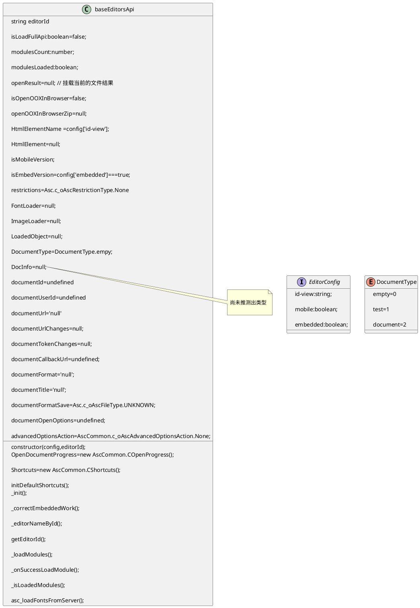
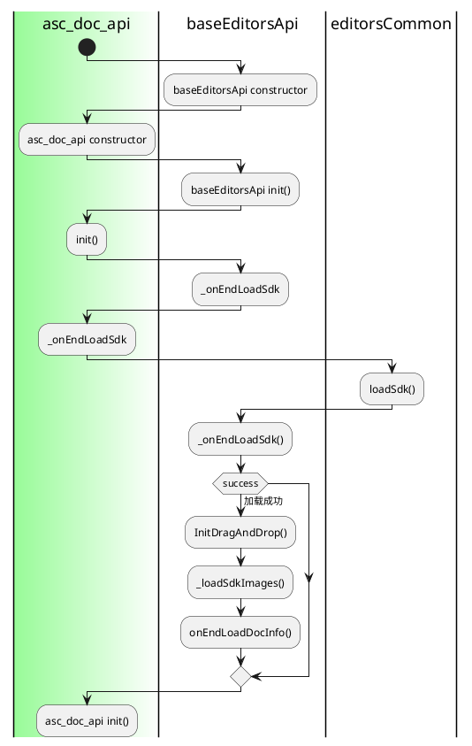

[TOC]

  

# sdkjs/common/apiBase.js

  

行数: 3765 行

  

依赖模块:

  

- AscCommon 对象来自 common/commonDefined.js

  

结构

  


  

调用流程

  



   

流程
```plantuml


  

class asc_docs_api{

    constructor(config);

    _init();

  

}

  

asc_docs_api -up-> baseEditorsApi
```
  

## construtor

  

1. 删除对应元素的 touch 形式

2. 初始化通信消息系统

3. AscCommon.loadSdk(),接返回执行 success

4. 初始化认证(CDocsCoApi),翻译管理器(translatemanager),拼写检查(CSpellCheckApi),快捷键(CShortcuts)

5. 取消,禁用 viewport 的鼠标滚轴(mousewheel)和 mouse scrool 事件

  

```javascript

/** @constructor */

function baseEditorsApi(config, editorId) {

  this.editorId = editorId;

  this.isLoadFullApi = false;

  this.modulesCount = 0;

  this.modulesLoaded = 0;

  this.openResult = null;

  this.isOpenOOXInBrowser = false;

  this.openOOXInBrowserZip = null;

  this.HtmlElementName = config['id-view'] || '';

  this.HtmlElement = null;

  this.isMobileVersion = config['mobile'] === true;

  this.isEmbedVersion = config['embedded'] === true;

  this.isViewMode = false;

  this.restrictions = Asc.c_oAscRestrictionType.None;

  this.FontLoader = null;

  this.ImageLoader = null;

  this.LoadedObject = null;

  this.DocumentType = 0; // 0 - empty, 1 - test, 2 - document (from json)

  this.DocInfo = null;

  this.documentId = undefined;

  this.documentUserId = undefined;

  this.documentUrl = 'null';

  this.documentUrlChanges = null;

  this.documentTokenChanges = null;

  this.documentCallbackUrl = undefined; // Ссылка для отправления информации о документе

  this.documentFormat = 'null';

  this.documentTitle = 'null';

  this.documentFormatSave = Asc.c_oAscFileType.UNKNOWN;

  

  this.documentOpenOptions = undefined; // Опции при открытии (пока только опции для CSV)

  

  // Тип состояния на данный момент (сохранение, открытие или никакое)

  this.advancedOptionsAction = AscCommon.c_oAscAdvancedOptionsAction.None;

  this.OpenDocumentProgress = new AscCommon.COpenProgress();

  var sProtocol = window.location.protocol;

  this.documentOrigin =

    (sProtocol && '' !== sProtocol ? sProtocol + '//' : '') +

    window.location.host; // for presentation theme url

  this.documentPathname = window.location.pathname; // for presentation theme url

  

  // Переменная отвечает, получили ли мы ответ с сервера совместного редактирования

  this.ServerIdWaitComplete = false;

  

  // Long action

  this.IsLongActionCurrent = 0;

  this.LongActionCallbacks = [];

  this.LongActionCallbacksParams = [];

  

  // AutoSave

  this.autoSaveGap = 0; // Интервал автосохранения (0 - означает, что автосохранения нет) в милесекундах

  this.lastSaveTime = null; // Время последнего сохранения

  this.autoSaveGapFast = 2000; // Интервал быстрого автосохранения (когда человек один) - 2 сек.

  this.autoSaveGapSlow = 10 * 60 * 1000; // Интервал медленного автосохранения (когда совместно) - 10 минут

  this.intervalWaitAutoSave = 1000;

  

  // Unlock document

  this.canUnlockDocument = false;

  this.canUnlockDocument2 = false; // Дублирующий флаг, только для saveChanges или unLockDocument

  this.canStartCoAuthoring = false;

  

  this.isDocumentCanSave = false; // Флаг, говорит о возможности сохранять документ (активна кнопка save или нет)

  

  // translate manager

  this.translateManager = AscCommon.translateManager.init(config['translate']);

  

  //shape names map by preset. Set from interface

  this.shapeNames = {};

  

  // Chart

  this.chartPreviewManager = null;

  this.textArtPreviewManager = null;

  this.shapeElementId = null;

  // 在文档编辑器中插入图表模式

  this.isChartEditor = false;

  this.isOpenedChartFrame = false;

  

  this.isOleEditor = false;

  

  this.MathMenuLoad = false;

  

  this.mathInputType = Asc.c_oAscMathInputType.Unicode;

  

  // CoAuthoring and Chat

  this.User = undefined;

  this.CoAuthoringApi = new AscCommon.CDocsCoApi();

  this.isCoAuthoringEnable = true;

  // Массив lock-ов, которые были на открытии документа

  this.arrPreOpenLocksObjects = [];

  

  // Spell Checking

  this.SpellCheckUrl = ''; // Ссылка сервиса для проверки орфографии

  

  // Результат получения лицензии

  this.licenseResult = null;

  // Получили ли лицензию

  this.isOnLoadLicense = false;

  // Переменная, которая отвечает, послали ли мы окончание открытия документа

  this.isDocumentLoadComplete = false;

  // Переменная, которая отвечает, послали ли мы окончание открытия документа

  this.isPreOpenLocks = true;

  this.isApplyChangesOnOpenEnabled = true;

  this.isProtectionSupport = true;

  

  this.canSave = true; // Флаг нужен чтобы не происходило сохранение пока не завершится предыдущее сохранение

  this.IsUserSave = false; // Флаг, контролирующий сохранение было сделано пользователем или нет (по умолчанию - нет)

  this.isForceSaveOnUserSave = false;

  this.forceSaveButtonTimeout = null;

  this.forceSaveButtonContinue = false;

  this.forceSaveTimeoutTimeout = null;

  this.forceSaveForm = null;

  this.disconnectOnSave = null;

  this.forceSaveUndoRequest = false; // Флаг нужен, чтобы мы знали, что данное сохранение пришло по запросу Undo в совместке

  

  // Version History

  this.VersionHistory = null; // Объект, который отвечает за точку в списке версий

  //Флаги для применения свойств через слайдеры

  this.noCreatePoint = false;

  this.exucuteHistory = false;

  this.exucuteHistoryEnd = false;

  this.selectSearchingResults = false;

  this.isSendStandartTextures = false;

  this.tmpFocus = null;

  this.fCurCallback = null;

  this.pluginsManager = null;

  this.isLockTargetUpdate = false;

  this.lastWorkTime = 0;

  this.signatures = [];

  this.currentPassword = '';

  this.disableAutostartMacros = false;

  this.macros = null;

  this.vbaMacros = null;

  this.vbaProject = null;

  this.openFileCryptBinary = null;

  this.copyOutEnabled = true;

  this.watermarkDraw = null;

  this.SaveAfterMacros = false;

  // Spell Checking

  this.SpellCheckApi = new AscCommon.CSpellCheckApi();

  this.isSpellCheckEnable = true;

  // macros & plugins events

  this.internalEvents = {};

  this.skinObject = config['skin'];

  this.Shortcuts = new AscCommon.CShortcuts();

  this.initDefaultShortcuts();

  this.isUseNativeViewer = true;

  this.openedAt = undefined;

  this.maxChangesSize = 0;

  this.binaryChanges = false;

  this.isBlurEditor = false;

  this._correctEmbeddedWork(); // 取消,禁用viewport的鼠标滚轴(mousewheel)和mouse scrool 事件

  return this;

}

```