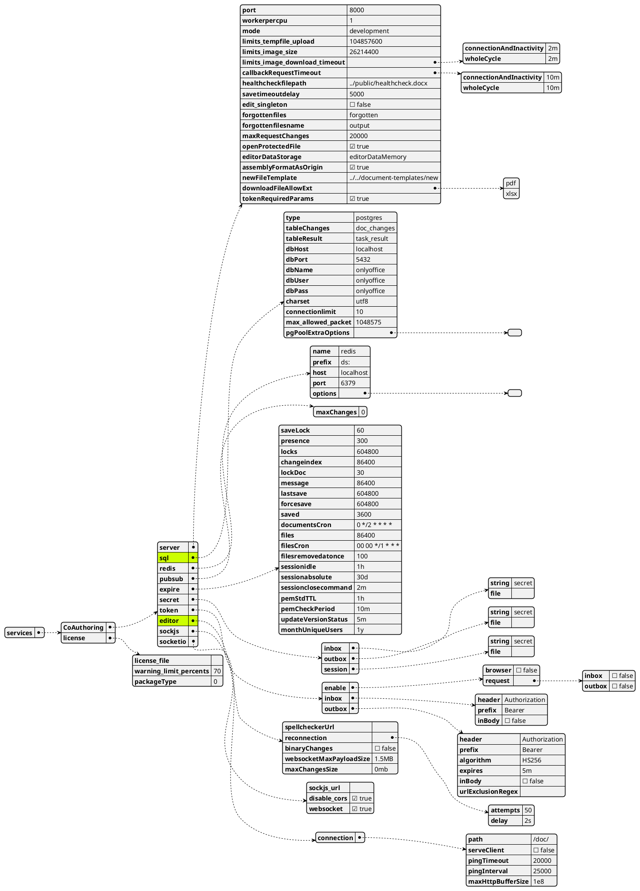
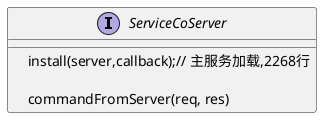
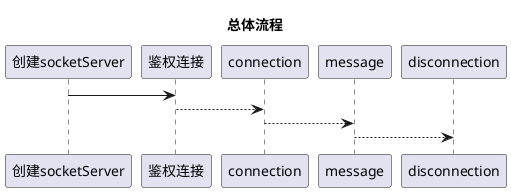
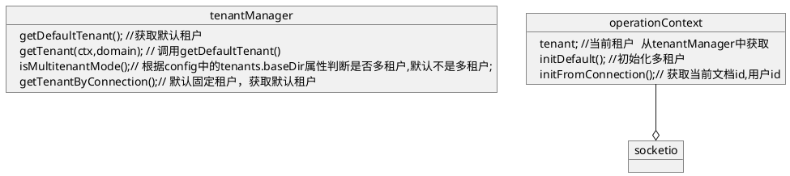
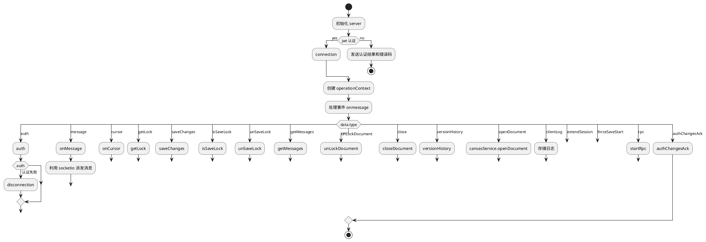
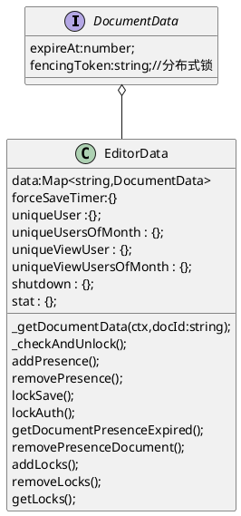

[Toc]

  

# 项目 DocService

  

文件 `source/DocService/Sources/DocCoService.js`

行数: 3922 行

  

依赖:

  

- socket.io

- underscore

- cluser

- crypto

- jsonwebtoken

- jwt

- ms  `将特定事件表达式转为millsecond` ,详情参看脚注[[_DocService.md#ms库使用说明]]

- deep_equal

  

## 引用的模块

  

- Common:

  - storage_done

  - logger

  - constans

  - utils

  - commondefines

  - statsdclient

  - license

- DocService

  - baseConnector

  - canvasService

  - connectorService

  - taskResult

  - gc

  - shutdown

  - pubsubRabbitmq

  - wopiClient

  

# 配置的对象

  

文件 `/Common/config/default.json`

  

# 功能:

  

- 动态插件功能: 将插件复制到指定插件目录下,会动态监测插件，自动强制推送插件更新事件

  

# 流程分析

  

1. 构建 Editor 配置对象

  



  

2. 模块暴露方法

  



  

2.1 install 方法流程

  



  

对象图

  



  

## 事件处理

  

### install

  



  

文件 `DocService/editorDataMemory.js`

  



  

### commandFromServer

  

```puml
start
:登陆认证;
:参数解析;
switch (param.c)
  case (info)
    :查询文档详情;
  break;
  case (drop)
    :销毁文档;
    break;
 break;
  case (save)
    :保存文档;
  break;
  case (forcesave)
    :强制保存;
    break;
  case (version)
    :查询版本;
    break;
  case (licence)
    :返回许可证;
    break;
endswitch
stop

```

  

---

  

  
## ms库使用说明
> npmjs 官方说明 https://www.npmjs.com/package/ms
   Use this package to easily convert various time formats to milliseconds.
```javascript
ms('2 days') // 172800000
ms('1d') // 86400000
ms('10h') // 36000000
ms('2.5 hrs') // 9000000
ms('2h') // 7200000
ms('1m') // 60000
ms('5s') // 5000
ms('1y') // 31557600000
ms('100') // 100
ms('-3 days') // -259200000
ms('-1h') // -3600000
ms('-200') // -200
```
 